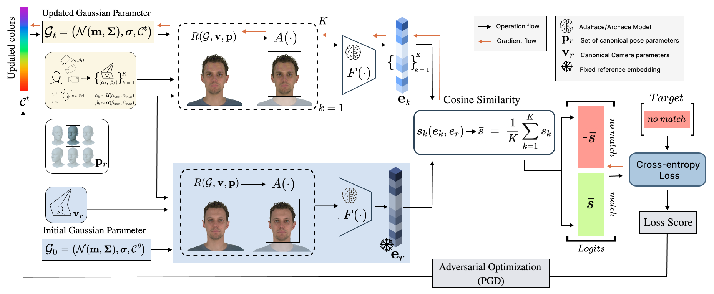

# AEGIS: Preserving privacy of 3D Facial Avatars with Adversarial Perturbations

**AEGIS** is the first privacy-preserving identity masking framework for 3D Gaussian Avatars that maintains subject's perceived characteristics. Our method aims to conceal identity-related facial features while preserving the avatar’s perceptual realism and functional integrity. AEGIS applies adversarial perturbations to the Gaussian color coefficients, guided by a pre-trained face verification network, ensuring consistent protection across multiple viewpoints without retraining or modifying the avatar’s geometry.

## Setup
###  [Installation](docs/INSTALLATION.md)

## Method


AEGIS adversarially optimizes the color parameters $\mathcal{C}^t$ of a 3D Gaussian avatar $\mathcal{G}$ to evade face recognition by the model $F(\cdot)$. A fixed reference embedding $\mathbf{e}_r$ is first obtained by rendering the original avatar $\mathcal{G}_0$ under canonical camera $\mathbf{v}_r$ and pose $\mathbf{p}_r$ parameters, and passing the result through $F(\cdot)$. During each PGD optimization step, a set of camera parameters $\{ \mathbf{v}_k \}_{k=1}^K$ is sampled to capture diverse viewpoints. The updated avatar $\mathcal{G}_t$ is rendered from these viewpoints using the rendering function $R(\cdot)$ and alignment module $A(\cdot)$, producing a batch of images. Identity embeddings $\{\mathbf{e}_k\}$ are then extracted using $F(\cdot)$, and their average cosine similarity $\bar{s}$ with the reference embedding $\mathbf{e}_r$ is computed. This similarity defines the logits ($\bar{s}$ for "match" and $-\bar{s}$ for "no match"), from which a cross-entropy loss is computed while targeting the "no match" class. The resulting loss is backpropagated through the network using PGD to update the color parameters $\mathcal{C}^t$, yielding an adversarial 3D representation.

## Usage
### 0. Demo
We provid an example unmasked avatar and its masked version in `/datasets`. You can view and play with rendered 3D Gaussian Avatar by running:
```
make render_avatar
```

### 1. Masking
In order to run masking process for the example avatar use:
```
make mask_avatar
```
If you want to modify default parameters refer to `scripts/mask_avatar.py`

### 2. Evaluation
Evaluation requires downloading CelebA, LFW and NeRSemble datasets as well as rendering reference NeRSembleGT dataset. In order to do so, refer to `scripts/download_datasets.sh` and `notebooks/build_reference_database.ipynb`. Then, after masking a set of avatars, different evaluations can performed using:
```
make eval_rank_k
make eval_verification
make eval_utility
```